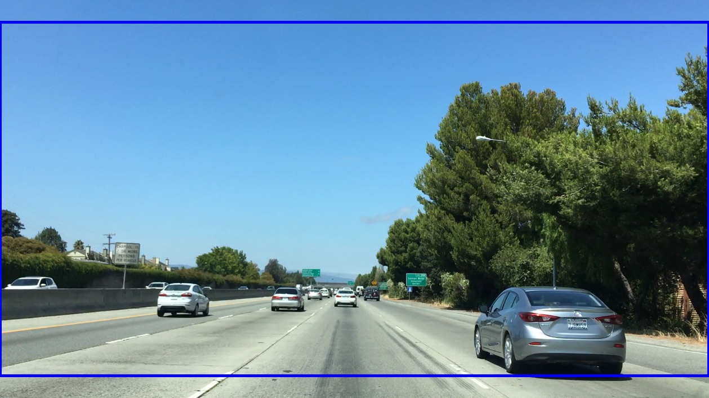
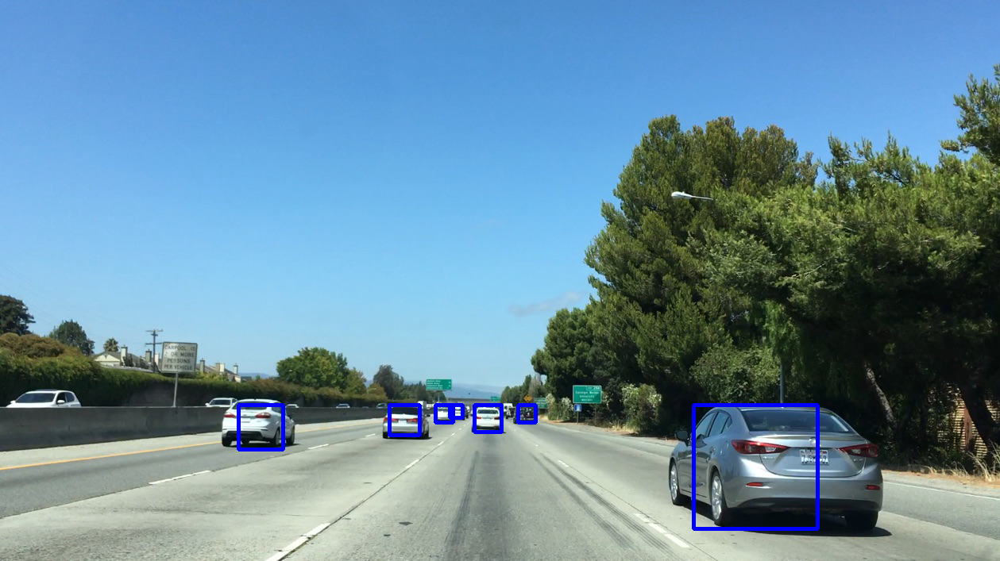
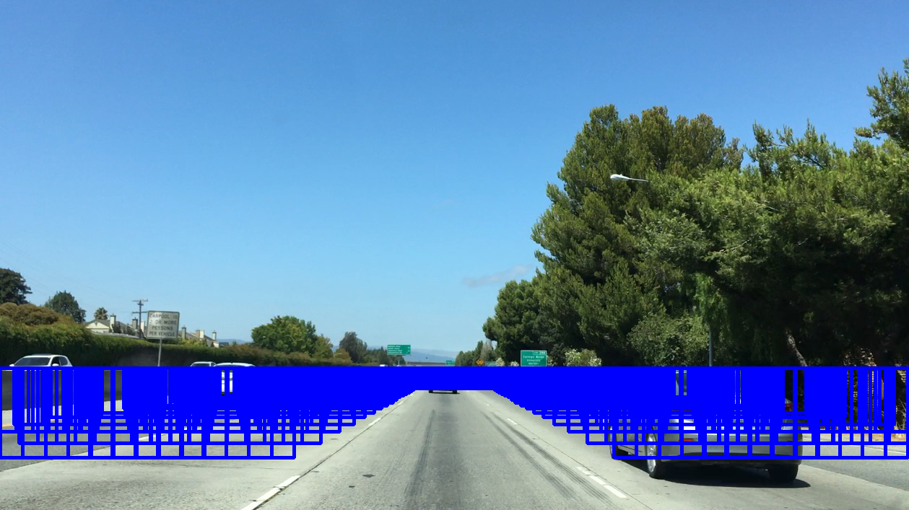
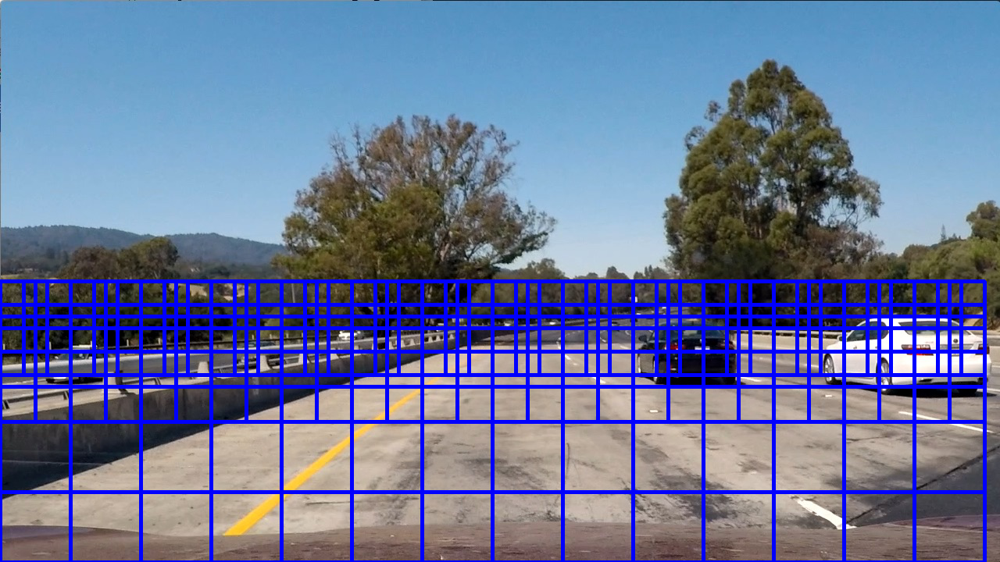
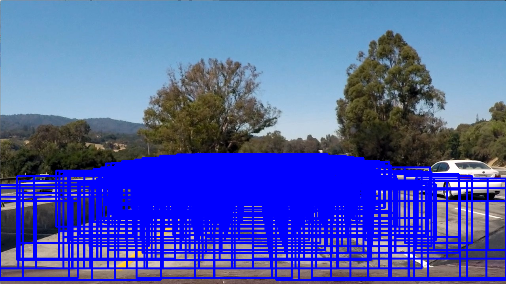

# Introduction

The goals / steps of this project are the following:

-   Perform a Histogram of Oriented Gradients (HOG) feature extraction
    on a labeled training set of images and train a Linear SVM
    classifier
-   Normalize features and randomize a selection for training and
    testing.
-   Implement a sliding-window technique and use trained classifier to
    search for vehicles in images.
-   Run pipeline on a video stream and create a heat map of recurring
    detections frame by frame to reject outliers and follow detected
    vehicles.
-   Estimate a bounding box for vehicles detected.

# Setup

The initial setup includes creating the [Python](https://www.python.org/) environment with the
packages that the project needs and uses.

**NOTE I**: The code for this project can be found in the repository's
[detect.py](detect.py) file.  *However*, all of the code in that file was
generated directly from the code blocks that appear in this file and
as such, contain no new information.  Reviewers can consult either
that Python file or this document.

**NOTE II**: This document is presented in a variety of formats.
There is this Emacs Org-Mode [file](writeup.md), a [PDF](writeup.pdf) generated using *LaTeX*, an
[HTML](writeup.html) file, and a [Markdown](writeup.md) file.  The Markdown file will be rendered
directly by GitHub when viewed on the web.  The HTML version can be
rendered either by cloning the repository to your own computer and
opening the file in a browser locally.  Or, you can view the same
file in GitHub Pages at [this link](https://dventimi.github.io/CarND-Advanced-Lane-Lines/writeup.html).  It looks quite a bit better than
the GitHub-rendered Markdown version.

-   **[matplotlib](http://matplotlib.org/):** plotting and image processing tools
-   **[NumPy](http://www.numpy.org/):** foundational scientific computing library
-   **[MoviePy](http://zulko.github.io/moviepy/):** video processing tools
-   **[OpenCV](http://opencv.org/):** computer vision library

The [GitHub](https://github.com/) [repository](https://github.com/dventimi/CarND-Advanced-Lane-Lines) for this project contains an [environment.yml](environment.yml)
file that can be used to create and activate a [Conda](https://conda.io/docs/) environment
with these commands.

    conda create --name CarND-Vehicle-Detection --clone CarND-Advanced-Lane-Lines
    source activate CarND-Vehicle-Detection
    conda env export > environment.yml

    conda env create --file environment.yml --name CarND-Vehicle-Detection
    source activate CarND-Vehicle-Detection

Once activated this environment is used to launch Python in whatever
way one likes, such as a [Python shell](https://www.python.org/shell/), a [IPython shell](https://ipython.org/), or a [jupyter
notebook](http://jupyter.org/).  Having done that, the usual first step is to import the
packages that are used.

    from glob import glob
    from itertools import groupby, islice, zip_longest, cycle, filterfalse, chain
    from moviepy.editor import VideoFileClip, VideoClip
    from random import choice, sample
    from scipy.ndimage.measurements import label
    from skimage.feature import hog
    from sklearn.model_selection import train_test_split
    from sklearn.preprocessing import StandardScaler
    from sklearn.svm import LinearSVC
    import cv2
    import math
    import matplotlib.image as mpimg
    import matplotlib.pyplot as plt
    import numpy as np
    import pdb
    import pickle

# Histogram of Oriented Gradients (HOG)

The first step in this project was to create a vehicle classifier
that was capable of identifying vehicles in an image, since we can
treat the frames of the video we are processing as individual
images.  Broadly, there are two main approaches for this task.  

-   [Computer Vision](https://en.wikipedia.org/wiki/Computer_vision)
-   [Neural Networks](https://en.wikipedia.org/wiki/Convolutional_neural_network)

Because the emphasis of this module in the Udacity course seemed to
focus on the computer vision approach, and because we already used
neural networks for two previous projects, I chose to explore the
first of these.

Though the two are similar (and have the same objective:
classification), one of the hallmarks of the computer vision
approach seems to be manual [feature extraction](https://en.wikipedia.org/wiki/Feature_extraction): relying on human
experience to select useful features for a [machine learning](https://en.wikipedia.org/wiki/Machine_learning) problem.
In the class, we explored several.

-   [color space](https://en.wikipedia.org/wiki/Color_space) selection
-   [binning](https://en.wikipedia.org/wiki/Data_binning) of spatial features
-   [color histograms](https://en.wikipedia.org/wiki/Color_histogram)
-   [histogram of oriented gradients (HOG)](http://www.learnopencv.com/histogram-of-oriented-gradients/)
-   hybrid approaches

I experimented with each of these approaches, and with various
combinations of them, and finally selected a simple combination:
color space transformation and HOG-features.  Specifically, after
trying several different color spaces, I settled on the [HSV](https://en.wikipedia.org/wiki/HSL_and_HSV) color
space and then performed HOG feature extraction on just the *V*
("value") channel.  Such a simple feature extractor may seem overly
simple&#x2014;and perhaps it is&#x2014;but the "proof is in the pudding," as
they say.  It performed well, with decent accuracy on a test sample
(~98%) and on the project video.  Moreover, it has the virtue of
requiring relatively few computational resources.  Anything that
increases performance is a big win, since it promotes rapid,
[iterative](https://en.wikipedia.org/wiki/Iterative_and_incremental_development) experimentation.  

Moreover, for the HOG parameters (orientations, pixelspercell,
cellsperblock), I started with the values that we used in the
quizzes in the lectures, and then manually tuned toward better
values by simple trial-and-error.  Because the classifier seemed to
do well on the test set, not much tuning was necessary.

Let's dive into some code to see how that went.

To set the stage, we were provided with two data archive files,
[vehicles.zip](vehicles.zip) and [non-vehicles.zip](non-vehicles.zip), which as the names suggest
contained images of vehicles and things that are not vehicles.

Here is an example of a vehicle image.

And, here is an example of a non-vehicle image.

The size of each image is 64 x 64 pixels, and the vehicle and
non-vehicle images are contained (after unpacking the archive files)
in directories `vehicle` and `non-vehicle`, respectively.  Now,
whatever classifier we use, we have to start by reading in these
images one way or another.  Confronted with tasks like this, I like
to compose small functions based on Python [generators](http://davidaventimiglia.com/python_generators.html), so first I
define a handful of useful utility functions.  

-   **feed:** generator function over a [glob](https://docs.python.org/2/library/glob.html), which maps a value `y` to
    each filename that matches `pattern`, yielding [tuples](https://docs.python.org/3/tutorial/datastructures.html#tuples-and-sequences)
-   **shuffle:** list-builder function over a sequence of tuples, which
    [reifies](https://www.merriam-webster.com/dictionary/reify) it into a randomized list
-   **scale:** non-generator function, which scales the values in an
    array, either by the maximum value in the array or by a
    supplied parameter `maxval`
-   **load:** generator function over a sequence of [ordered pairs](https://en.wikipedia.org/wiki/Ordered_pair) in
    which the first element is an image filename and the
    second is any value (perhaps provided by the `feed`
    function above), which loads the image files into NumPy
    arrays
-   **flip:** generator function over a sequence of ordered pairs in
    which the first element is a NumPy array and the second is
    any value, which "flips" the array horizontally (i.e.,
    across a vertical axis) and producing a mirror image
-   **mirror:** generator function over a sequence of ordered pairs as
    in `flip`, but which yields first the entire sequence
    unchanged and then the entire sequence again but with the
    images flipped

    feed = lambda pattern, y: ((f, y) for f in glob(pattern))
    shuffle = lambda l: sample(l, len(l))
    scale = lambda img,maxval=None: (img/np.max(img)*255).astype(np.uint8) if maxval==None else (img/maxval*255).astype(np.uint8)
    load = lambda g: ((mpimg.imread(x[0]),x[1]) for x in g)
    flip = lambda g: ((x[0][:,::-1,:],x[1]) for x in g)
    mirror = lambda g: chain(g, flip(g))

When composed together, these functions provide a generator that
[lazily loads](https://en.wikipedia.org/wiki/Lazy_loading) training images in random order, twice: first
unflipped, and second flipped.  This serves several related
purposes.  First, randomizing data for training purposes is a
best-practice in Machine Learning.  Second, it effectively doubles
the size of our training set.  Third, we anticipate encountering
vehicles on the road from any angle, where the vehicles themselves
are inherently symmetric across a vertical plane running
longitudinally down the length of the car.

Before we can use this generator, however, we need something to use
it on.  Let's define our functions for extracting features and for
creating our classifiers.

First, the `extract_features` function transforms a given image to a
target color space, performs HOG feature extraction on a target
color channel, then [scales](http://scikit-learn.org/stable/modules/preprocessing.html#scaling-features-to-a-range) the features.

    def extract_features(img,
                         colorspace=cv2.COLOR_RGB2HSV,
                         channel=2,
                         orient=9,
                         pix_per_cell=8,
                         cell_per_block=4,
                         transform_sqrt=False,
                         feature_vec=True):
        img = scale(img)
        X = np.array([])
        X = np.append(X,
                      hog(cv2.cvtColor(img, colorspace)[:,:,channel],
                          orient,
                          (pix_per_cell,pix_per_cell),
                          (cell_per_block,cell_per_block),
                          transform_sqrt = transform_sqrt,
                          feature_vector = feature_vec))
        s = StandardScaler().fit(X)
        return s.transform(X)

Note that many of the parameters are supplied with default values.
That is no accident.  The values given above, and repeated here, are
the ones used throughout this project, and were obtained through
experimentation by trial-and-error.

<table border="2" cellspacing="0" cellpadding="6" rules="groups" frame="hsides">

<colgroup>
<col  class="left" />

<col  class="left" />

<col  class="left" />
</colgroup>
<thead>
<tr>
<th scope="col" class="left">Parameter</th>
<th scope="col" class="left">Value</th>
<th scope="col" class="left">Description</th>
</tr>
</thead>

<tbody>
<tr>
<td class="left">`colorspace`</td>
<td class="left">`COLOR_RGB2HSV`</td>
<td class="left">target color space</td>
</tr>

<tr>
<td class="left">`channel`</td>
<td class="left">`2`</td>
<td class="left">target color channel</td>
</tr>

<tr>
<td class="left">`orient`</td>
<td class="left">`9`</td>
<td class="left">HOG orientation bins</td>
</tr>

<tr>
<td class="left">`pix_per_cell`</td>
<td class="left">`8`</td>
<td class="left">pixels per HOG cell</td>
</tr>

<tr>
<td class="left">`cell_per_block`</td>
<td class="left">`4`</td>
<td class="left">cells per HOG block</td>
</tr>

<tr>
<td class="left">`transform_sqrt`</td>
<td class="left">`False`</td>
<td class="left">scale values by `math.sqrt`</td>
</tr>

<tr>
<td class="left">`feature_vec`</td>
<td class="left">`True`</td>
<td class="left">return feature vector</td>
</tr>
</tbody>
</table>

Next, the `get_classifier` function returns a function which is
itself a trained classifier.  Parameters control whether or not to
train the classifier anew or to load a pre-trained classifier from a
file, and what the training/test set split should be when training a
new one.

    def get_classifier(reload=False,test_size=0.2):
        if reload:
            samples = list(chain(feed("vehicles/**/*.png",1),feed("non-vehicles/**/*.png",0)))
            data = cycle(mirror(load(shuffle(samples))))
            X_train,X_test,y_train,y_test = train_test_split(*zip(*((extract_features(s[0]), s[1]) for s in islice(data, len(samples)))), test_size=test_size, random_state=np.random.randint(0, 100))
            svc = LinearSVC()
            svc.fit(X_train, y_train)
            pickle.dump(svc, open("save.p","wb"))
            print('Test Accuracy of SVC = ', round(classifier.score(X_test, y_test), 4))
        else:
            svc = pickle.load(open("save.p", "rb"))
        return svc

Note the use of our composable utility functions to load the data
here and here.  Note also that there are a variety of classifiers we
could use.

-   [Support Vector Machine (SVM)](https://en.wikipedia.org/wiki/Support_vector_machine)
-   [Random Forest](https://en.wikipedia.org/wiki/Random_forest)
-   [Naive Bayes](https://en.wikipedia.org/wiki/Naive_Bayes_classifier)

I was prepared to experiment with each of these, and perhaps with
their combinations.  I started with an SVG, however, and found that
it performed well all on its own.

Training a classifier now is as simple as

    # classifier = get_classifier(True)

    Test Accuracy of SVC =  0.9938

while loading a saved classifier is even simpler

    classifier = get_classifier()

Saving and re-loading classifiers like in this second command was
very helpful in this project for promoting rapid iteration, because
once I had a classifier I was happy with, I could move onto
subsequent stages in the project without needing to retrain the
classifier every time. 

# Sliding Window Search I

I performed the most experimentation on various sliding window
schemes.  Initially, I expended effort on behalf of a single idea:
*Can I model vehicle position not in screen coordinates, measured in
pixels, but rather in real-world coordinates, measured in meters?*
My strategy was to generate sliding windows on a three-dimensional
(3D) grid whose origin is where the camera is placed and whose units
are meters, and then use geometry to project those windows onto the
screen in pixel coordinates.  This model has these assumptions.

-   The image plane roughly corresponds to the vehicle's windshield.
-   The windshield is approximately 2 meters wide, 1 meter tall, and 2
    meters above the road.
-   The camera is placed approximately 1 meter behind the windshield's
    center, with a line-of-sight (LOS) perpendicular to it.
-   The grid coordinates \(\left( x, y, z \right)_{grid}\) correspond to
    the horizontal position across the road, the vertical position
    above the road, and the longitudinal position down the road.
-   Positive \(x\) values are to the right, negative \(x\) values are to
    the left, and \(x_{grid} \in \left[ -15, 15 \right]\).
-   Negative \(y\) values are below the camera, and \(y_{grid} \in \left[
        -2, 0 \right]\).
-   \(z \lt 1\) values are inside the car, and \(z_{grid} \in \left[ 10,
        100 \right]\).

These assumptions determine the geometry of the problem and set its
physical scale, with a field-of-view (FOV) of 90°, and allow us to
create sliding windows as described above.  In principle, vehicle
detections on image patches can then be assigned real-world
coordinates \((x, y, z)\), or at least road coordinates \((x,
  z)_{y=0}\), a real-world "heat map" can be built up, and then
individual vehicles can be identified either with conventional
thresholds + [labeling](http://scikit-image.org/docs/dev/auto_examples/segmentation/plot_label.html), with a [Laplace-of-Gaussian](https://en.wikipedia.org/wiki/Blob_detection) technique, or
with [*k*-means clustering](https://docs.scipy.org/doc/scipy-0.18.1/reference/cluster.vq.html).

The following coordinate conversion functions support the geometrical model outlined
above.

-   **crt2cyl:** Cartesian-to-cylindrical
-   **cyl2crt:** cylindrical-to-Cartesian
-   **cyl2sph:** cylindrical-to-spherical
-   **sph2cyl:** spherical-to-cylindrical
-   **crt2sph:** Cartesian-to-spherical
-   **sph2crt:** spherical-to-Cartesian

    crt2cyl = lambda x,y,z: (math.sqrt(x**2+y**2), math.atan2(y,x), z)
    cyl2crt = lambda rho,phi,z: (rho*math.cos(phi), rho*math.sin(phi), z)
    cyl2sph = lambda rho,phi,z: (math.sqrt(rho**2+z**2), math.atan2(rho, z), phi)
    sph2cyl = lambda r,theta,phi: (r*math.sin(theta), phi, r*math.cos(theta))
    crt2sph = lambda x,y,z: (math.sqrt(x**2+y**2+z**2), math.acos(z/math.sqrt(x**2+y**2+z**2)), math.atan2(y,x))
    sph2crt = lambda r,theta,phi: (r*math.sin(theta)*math.cos(phi), r*math.sin(theta)*math.sin(phi), r*math.cos(theta))

The `get_window` function computes from \((x,y,z)\) a "window", which
is a list of tuples wherein the first two provide the corners of its
"bounding box" and the last provides the coordinates of its center.
Note that it also takes `height` and `width` parameters for the
physical size (in meters) of the window, as well as a `horizon`
parameter, which is the fraction of the image plane (from below) at
which the horizon appears.  The default value of `0.5` corresponds
to the middle.  Finally, like many of my functions it takes a NumPy
image array parameter, `img`, which is mainly for extracting the
size and shape of the image.

    def get_window(img, x, y, z, horizon=0.5, width=2, height=2):
        d = 1
        r,theta,phi = crt2sph(x,y,z)
        rho2 = d*math.tan(theta)
        x2,y2 = (rho2*math.cos(phi),rho2*math.sin(phi))
        center = (int(img.shape[1]*0.5+x2*img.shape[1]//2),
                  int(img.shape[0]*(1-horizon)-y2*img.shape[1]//2))
        scale = img.shape[1]//2
        dx = int(width/2*scale/z)
        dy = int(height/2*scale/z)
        window = [(center[0]-dx,center[1]-dy), (center[0]+dx,center[1]+dy)] + [(x,y,z)]
        return window

Next, the `draw_window` function annotates an image `img` with the
window `bbox`.  This does not factor into the actual vehicle
detection, of course, but the visualization is valuable for
understanding how the video processing pipeline ultimately is
working.

    def draw_window(img, bbox, color=(0,0,255), thick=3):
        cv2.rectangle(img, bbox[0], bbox[1], color, thick)
        return img

For example, first we draw a window box that roughly corresponds to
the windshield itself, using a test image from the lecture notes.
The windshield's center is at real-world coordinates
\((x,y,z)_{windshield} = (0,0,1)\).

    image = scale(mpimg.imread("bbox-example-image.jpg"))
    draw_window(image, get_window(image, 0, 0.0, 1, horizon=0.5, width=2, height=1))
    mpimg.imsave("output_images/windshield.png", image, format="png")

Next, we draw window boxes around a few of the cars in the image.
Note that here we are eschewing the default value of `horizon` in
favor of `0.28`, given the peculiar tilt the camera seems to have in
this image.  That value, like the real-world vehicle coordinates
\((x,y,z)_i\), were obtained by hand through trial-and-error.

    image = scale(mpimg.imread("bbox-example-image.jpg"))
    draw_window(image, get_window(image, 4.1, -1.0, 8, horizon=0.28))
    draw_window(image, get_window(image, -10.5, -1.0, 22, horizon=0.28))
    draw_window(image, get_window(image, -6.1, -1.0, 32, horizon=0.28))
    draw_window(image, get_window(image, -0.8, -1.0, 35, horizon=0.28))
    draw_window(image, get_window(image, 3, -1.0, 55, horizon=0.28))
    draw_window(image, get_window(image, -6.1, -1.0, 55, horizon=0.28))
    draw_window(image, get_window(image, -6.1, -1.0, 70, horizon=0.28))
    mpimg.imsave("output_images/bbox-example-image-test.png", image, format="png")

In order to help visualize the geometry further, we animate a
handful of windows receding into the distance.

    def zooming_windows(img):
        def make_frame(t):
            frame = np.copy(img)
            z = 2**(t % 5)*5
            draw_window(frame, get_window(frame,-10.5,-1.0,z,horizon=0.28))
            draw_window(frame, get_window(frame,-6.1,-1.0,z,horizon=0.28))
            draw_window(frame, get_window(frame,-0.8,-1.0,z,horizon=0.28))
            draw_window(frame, get_window(frame,4.1,-1.0,z,horizon=0.28))
            cv2.putText(frame, "z: %.2f m" % z, (50,50), cv2.FONT_HERSHEY_DUPLEX, 1, (255,255,255), 2)
            return frame
        return make_frame

    clip = VideoClip(zooming_windows(mpimg.imread('bbox-example-image.jpg')), duration=5)
    clip.write_videofile("output_images/zooming-windows.mp4", fps=25)

<iframe width="800" height="450" src="https://www.youtube.com/embed/lqp9rOSPVrc" frameborder="0" allowfullscreen></iframe>

This is just for visualization.  For vehicle detection, a denser
grid should be used, and we raster the windows horizontally as they
ratchet down-range.  We also confine the windows to a horizontal
plane, at \(z = -1\).  But, because this sliding window and other ones
like it actually will be used in the vehicle-detection
video-processing pipeline, it is worthwhile to remove windows that
exceed the image boundary.  That is the purpose of the `clip_window`
function.

    def clip_window(x, box):
        return sum([box[0]<=x[0][0]<=box[1],
                    box[0]<=x[1][0]<=box[1],
                    box[2]<=x[0][1]<=box[3],
                    box[2]<=x[1][1]<=box[3]])==4

Since our strategy will be to write functions to produce "grids"
that can be used both for visualization and for vehicle-detection,
we refactor much of the animated visualization into a new function,
`get_frame_maker`.

    def get_frame_maker(img, grid):
        def make_frame(t):
            frame = np.copy(img)
            draw_window(frame, grid.__next__()[:2], color=(0,255,255))
            return frame
        return make_frame

With these tools, first we define a "sparse grid"

    def sparse_scan(img):
        grid = np.mgrid[-15:15:2,-1.0:0:2,3:7:1]
        grid[2,]=2**grid[2,]
        grid = grid.T.reshape(-1,3)
        grid = (get_window(img,x[0],x[1],x[2], horizon=0.28)+[x] for x in grid)
        grid = filter(lambda x: clip_window(x, (0, img.shape[1], (img.shape[0]//2), img.shape[0])), grid)
        return grid

visualize its 40 windows

    image = scale(mpimg.imread("bbox-example-image.jpg"))
    print(len(list(map(lambda w: draw_window(image, w[:2]), sparse_scan(image)))))
    mpimg.imsave("output_images/sparse-scan.png", image, format="png")

    52

and then animate them.

    clip = VideoClip(get_frame_maker(image, cycle(sparse_scan(image))), duration=10)
    clip.write_videofile("output_images/sparse-scan.mp4", fps=25)

<iframe width="800" height="450" src="https://www.youtube.com/embed/Vn1HxPRd2W0" frameborder="0" allowfullscreen></iframe>

We can also define a "dense grid" with more windows, scanning the
roadway with finer resolution in the \(x\) and \(z\) directions.  We
skip the animation this time, as it is rather boring.

    def dense_scan(img, h=2,w=2):
        grid = np.mgrid[-15:15:0.5,-1.0:0:2,10:100:2]
        grid = grid.T.reshape(-1,3)
        grid = (get_window(img,x[0],x[1],x[2], horizon=0.28, height=h, width=w)+[x] for x in grid)
        grid = filter(lambda x: clip_window(x, (0, img.shape[1], (img.shape[0]//2), img.shape[0])), grid)
        return grid

When produce the grid image, note that it has 2600+ windows!  That
probably is excessive and would slow down video processing.

    image = scale(mpimg.imread("bbox-example-image.jpg"))
    print(len(list(map(lambda w: draw_window(image, w[:2]), dense_scan(image)))))
    mpimg.imsave("output_images/dense-scan.png", image, format="png")

    2653

The sparse scan above probably is too sparse, but one way we can
reduce the number of windows would be to search the perimeter of the
road, where new cars are likely to come on-stage.  

    def perimeter_scan(img):
        grid = np.mgrid[-15:15:0.5,-1.0:0:2,10:100:2]
        grid = grid.T.reshape(-1,3)
        grid = list(filter(lambda x: not (-4<=x[0]<=4 and 5<=x[2]<=40), grid))
        grid = (get_window(img,x[0],x[1],x[2], horizon=0.28)+[x] for x in grid)
        grid = filter(lambda x: clip_window(x, (0, img.shape[1], (img.shape[0]//2), img.shape[0])), grid)
        return grid

    image = scale(mpimg.imread("bbox-example-image.jpg"))
    print(len(list(map(lambda w: draw_window(image, w[:2]), perimeter_scan(image)))))
    mpimg.imsave("output_images/perimeter-scan.png", image, format="png")

    2381

Sadly, this barely makes a dent in reducing the number of windows.  

In order to make headway, a simple choice is just to stick with the
dense grid, perform vehicle detections with it against a test image,
and gauge its performance.

To do that, we need a function `get_patches`, that takes a *window*,
which again is mainly a bounding-box (with pixel dimensions) into a
*patch*, which is a NumPy image sub-array taken from a larger image.

    def get_patches(img, grid, size=(64,64)):
        return ((cv2.resize(img[window[0][1]:window[1][1],
                                window[0][0]:window[1][0]],size),window) for window in grid)

Armed with that function, next we just map our classifier over all
of the window patches on an image.

    def process(x):
        return (classifier.predict(extract_features(x[0]))[0],x[1])

    results = list(map(process, get_patches(image, dense_scan(image))))
    print(len(results))

    2653

To visualize where vehicle detections have occurred on our dense grid
over the road, we filter the processed results that have a value
greater than 1 (i.e., a detection has occurred for that window patch)

    _,r = zip(*filter(lambda x: x[0]>0, results))
    _,_,cen,_ = zip(*r)
    x,y,z = zip(*cen)
    plt.scatter(x,z,s=50,c=y)

    >>> >>> <matplotlib.collections.PathCollection object at 0x7f8fb84b2710>

These results are interesting and suggestive.  The contiguous
regions of detections presumably correspond to vehicles, with their
2D location associated with the "center" of each island.  However,
projection effects seem to elongate the detected regions with a
strong, pronounced radial pattern, which could be problematic.
Perhaps with suitable thresholding, a technique as simple as the
`label` function would be sufficient for picking out the cars.  On
the other hand, we might need more sophisticated techniques, such as
[Laplace-of-Gaussian](https://en.wikipedia.org/wiki/Blob_detection) or with [*k*-means clustering](https://docs.scipy.org/doc/scipy-0.18.1/reference/cluster.vq.html).  This is an
intriguing direction of inquiry to pursue in further studies,
however in this one I found that I was running out of time.  

So, I switched gears to a more traditional sliding windows approach.

# Sliding Window Search II

To refresh the reader, a more traditional sliding windows approach
models a grid of windows and their image patches not in real-world
3D physical space, but in 2D image space.  This involves trade-offs.
On the one hand, we give up a straightforward 3D interpretation of a
vehicle detection event.  In principle, we could still recover
distance information by deprojecting the window (the reverse of our
operation above), but at the expense of greater complication.  On
the other hand, we gain with this trade-off a simpler implementation
that already has a proven track-record.

We can reuse much of our other code, though, since we just need to
define functions to produce grids that obey whatever selection
functions we desire.

First up is a simple "image-plane scan", which carpets the image
plane in a uniform grid of windows at various fixed scales.

    def image_plane_scan(img,ny,overlap,scale):
        size = int(img.shape[0]//ny)//scale
        delta = int(size*(1-overlap))
        box1 = (0,
                img.shape[1],
                (img.shape[0]-img.shape[0]//scale)//2,
                img.shape[0] - (img.shape[0]-img.shape[0]//scale)//2)
        box2 = (0,
                img.shape[1],
                (img.shape[0]//2),
                img.shape[0])
        grid = np.mgrid[0:img.shape[1]:delta,
                        img.shape[0]:-delta:-delta].T.reshape(-1,2)
        grid = ([(c[0],c[1]), (c[0]+size,c[1]+size)] for c in grid)
        grid = filter(lambda x: clip_window(x, box1), grid)
        grid = filter(lambda x: clip_window(x, box2), grid)
        return grid

    image = scale(mpimg.imread("test_images/test1.jpg"))
    print()
    print("Number of windows: %s" %
          len(list(map(lambda w: draw_window(image, w[:2]),
                       chain(
                           image_plane_scan(image,4,0.50,1),
                           image_plane_scan(image,4,0.50,2),
                           image_plane_scan(image,4,0.50,3)
                       )))))
    mpimg.imsave("output_images/imageplane-scan.png", image, format="png")

This produces 1400+ images, which highlights a persistent problem I
grappled with.  There is an inherent trade-off between the accuracy
of a dense window sample, and the performance of a sparse window sample.

A conjecture I had to help ease the tension between these two poles
was to relax the constraint of a regular grid of windows in favor of
a random scattering of windows.  One of the reasons the window count
soared with a regular grid was the overlap; a high degree of overlap
(>50%) was needed for higher spatial resolution of detected vehicle
locations, but the number of windows is essentially quadratic in the
degree of overlap.  However, the stochastic behavior of an irregular
random sampling of windows means that a higher spatial resolution
can be achieved in an economy of window patches.  

The trade-offs here, however, are two-fold.  First, we no longer can
pre-compute the grid, but instead must compute a new random ensemble
of windows for each video frame.  In the testing that I did, this
proved to be of little concern; the Python profiler, and experience
as well, showed that the grid computation time was relatively
trivial.  The bulk of the time was spent on feature extraction and
classification for each window patch, a task that obviously cannot
be precomputed irrespective of the grid strategy.

Second, since any one *particular* frame is treated with a
relatively sparse (but now random) irregular grid of windows, this
intensifies the need for integrating the signal over multiple frames
(a task we anticipated in any case).  Consequently, we lose
resolution in the time domain.  While that could be a problem for
fast-moving vehicles, it was not for the relatively slow relative
velocity of the vehicles in our project video.

My first version of a random scan uses a region-of-interest mask
that selects out a trapezoidal region covering just the border of
the road.

    def region_of_interest(img, vertices):
        mask = np.zeros_like(img)   
        if len(img.shape) > 2:
            channel_count = img.shape[2]
            ignore_mask_color = (255,) * channel_count
        else:
            ignore_mask_color = 255
        cv2.fillPoly(mask, vertices, ignore_mask_color)
        masked_image = cv2.bitwise_and(img, mask)
        return masked_image

The actual function `random_scan` takes an image `img` (again, just
for the size information), and a window size.  Since these we are
now operating in the pixel coordinates of the image plane rather
than in the physical coordinates of the real world, the window size
is taken just in pixels.  This function works by thresholding a
random array.  It is a somewhat elegant technique, but is
inefficient and *slowww*.

    def random_scan(img,size):
        x = np.random.rand(*img.shape[:2])
        x[x<0.999] = 0
        x = scale(np.ceil(x))
        x = region_of_interest(x, np.array([[[0, 0.5*image.shape[0]],
                               [image.shape[1], 0.5*image.shape[0]],
                               [image.shape[1], image.shape[0]],
                               [(1-2/6)*image.shape[1], 0.5*image.shape[0]],
                               [(2/6)*image.shape[1], 0.5*image.shape[0]],
                               [0, image.shape[0]]]]).astype('int'))
        x = np.dstack(np.nonzero(x))
        s = np.random.choice(2**np.arange(4), len(x[0]))
        grid = ([(c[1],c[0]),
                 (c[1]+size,c[0]+size)] for c in x[0])
        return grid

    image = scale(mpimg.imread("test_images/test1.jpg"))
    print()
    print("Number of windows: %s" %
          len(list(map(lambda w: draw_window(image, w[:2]),
                       chain(
                           random_scan(image,180),
                           random_scan(image,90),
                           random_scan(image,60)
                       )))))
    mpimg.imsave("output_images/random-scan1.png", image, format="png")

The next random grid function `random_scan2`, uses a slightly
less-elegant approach, but is noticeably faster.  Aside from
confining the window to the bottom half of the image, however, it
does not use a region-of-interest mask.

    def random_scan2(img,size,num=100):
        x = np.random.rand(num,2)
        x[:,0]*=image.shape[1]
        x[:,1]*=image.shape[1]
        x = x.astype('int')
        x = x[x[:,1]<image.shape[0]]
        x = x[x[:,1]>=image.shape[0]//2]
        box = (0,img.shape[1],(img.shape[0]//2),650)
        grid = ([(c[0],c[1]),
                 (c[0]+size,c[1]+size)] for c in x)
        grid = filter(lambda x: clip_window(x, box), grid)
        return grid

    image = scale(mpimg.imread("test_images/test1.jpg"))
    print("Number of windows: %s" %
          len(list(map(lambda w: draw_window(image, w[:2]),
                       chain(
                           random_scan2(image,256,1000),
                           random_scan2(image,128,1000),
                           random_scan2(image,64,1000)
                       )))))
    mpimg.imsave("output_images/random-scan2.png", image, format="png")

    ... ... ... ... ... ... Number of windows: 311

The next random scanner I tried worked in polar (pixel) coordinates
so as to achieve a masking affect, that concentrates windows on the
road borders where vehicles are most likely to appear.

    def random_scan3(img,size,num=100,minr=None,maxr=None,mintheta=None,maxtheta=None,center=None,scale=True):
        if center==None:
            center = tuple(np.array(image.shape[:2][::-1])//2)
        polar = np.random.rand(num,2)
        polar[:,0]*=image.shape[1]
        polar[:,1]*=math.pi*2
        if not minr==None:
            polar = polar[polar[:,0]>=minr]
        if not maxr==None:
            polar = polar[polar[:,0]<maxr]
        if not mintheta==None:
            polar = polar[polar[:,1]>=0]
        if not maxtheta==None:
            polar = polar[polar[:,1]<maxtheta]
        if scale:
            s = (size//2*polar[:,0]/image.shape[1]).astype('int')
        else:
            try:
                dist = int(math.sqrt(sum([(center[0]-image.shape[1]//2)**2,
                                          (center[1]-image.shape[0]//2)**2])))
                s = [int(size*(dist/(image.shape[1]//2)))]*len(polar)
            except:
                pdb.set_trace()
        x,y=zip(*np.dstack((center[0]+polar[:,0]*np.cos(polar[:,1]),
                            center[1]+polar[:,0]*np.sin(polar[:,1]))).astype('int')[0])
        grid = ([(c[0]-c[2],c[1]-c[2]), (c[0]+c[2],c[1]+c[2])] for c in zip(x,y,s))
        box = (0,img.shape[1],(0),670)
        grid = filter(lambda x: clip_window(x, box), grid)
        return grid

    image = scale(mpimg.imread("test_images/test1.jpg"))
    print("Number of windows: %s" %
          len(list(map(lambda w: draw_window(image, w[:2]),
                       chain(
                           random_scan3(image,image.shape[1]//4,
                                        3000,
                                        minr=image.shape[0]//3,
                                        mintheta=0,
                                        maxtheta=math.pi)
                       )))))
    mpimg.imsave("output_images/random-scan3.png", image, format="png")

    ... ... ... ... ... ... ... ... Number of windows: 199

This produces an interesting pattern, but I was not comfortable
peculiar way the windows are scaled to different sizes, so I wrote
yet another grid window function `random_scan4`, which is a bit of a
hybrid.  It actually re-uses the 3D model described above in
**Sliding Window Search I**.  Windows are defined in a 3D volume which
covers the road from left to right, from the car to the horizon, and
from the camera level down to the road.  I.e., it is like a long,
thick "ribbon", within which windows are randomly sampled.  As
above, we are back in physical space for window sizes, rather than
in pixel space.  Finally, the physical space windows are projected
back onto the image plane to give us a grid window in pixel-space.
In fact, this is almost exactly as we did in the earlier section.
The main differences are:

1.  We discard the 3D window location information after projecting it
    to a grid window on the image plane.
2.  Window locations are randomly drawn from the 3D volume described
    above, rather than laid out in a regular array.

    def random_scan4(img,size,num=100,width=25,left=-12.5):
        grid = np.random.rand(num,3)
        grid[:,0]*=width
        grid[:,1]*=2
        grid[:,1]-=2
        grid[:,2]*=40
        grid[:,0]+=left
        grid[:,1]-=4
        grid[:,2]+=5
        grid = grid.astype('int')
        grid = (get_window(img,x[0],x[1],x[2], height=4, width=4)+[x] for x in grid)
        grid = filter(lambda x: clip_window(x, (0, img.shape[1], (img.shape[0]//2), img.shape[0])), grid)
        return grid

    image = scale(mpimg.imread("test_images/test1.jpg"))
    print(len(list(map(lambda w: draw_window(image, w[:2]), random_scan4(image,2,1000)))))
    mpimg.imsave("output_images/random-scan4.png", image, format="png")

    813

Note that the above function takes parameters `width` and `left`
which set the width of the "ribbon" volume, and its left edge (in
meters).  We can easily combine a couple calls to this grid
generating function with judicious parameter choices in order to
archive interesting search patterns.  For instance, in
`random_scan5`, we superimpose two ribbons, one on the left, and one
on the right, in order just to search the road borders.

    def random_scan5(img,size,num=100):
        grid = chain(random_scan4(img,size,num//2,width=20,left=-30),
                     random_scan4(img,size,num//2,width=20,left=+10))
        return grid

    image = scale(mpimg.imread("test_images/test1.jpg"))
    print(len(list(map(lambda w: draw_window(image, w[:2]), random_scan5(image,2,1000)))))
    mpimg.imsave("output_images/random-scan5.png", image, format="png")

    587

While we may not want to search in this way in general, since the
void in the middle is a giant "blind spot", as a visualization this
has the nice property of removing foreground windows so that the way
they naturally scale with distance is revealed.  

# Video Implementation

With a variety of strategies for searching a video frame for vehicle
detection events, the next major step is to adapt those strategies
into an implementation of a video-processing pipeline.  The
processing pipeline has these major steps.

1.  Get a frame of video.
2.  Generate a grid of windows using one of the schemes developed
    above.
3.  Using the frame image and the grid of windows, generate a
    sequence of patches, which are small (64 x 64 pixel) sub-arrays,
    compatible with our classifier.
4.  Apply the classifier as a stencil over the sequence of patches to
    generate a sequence of detection/non-detection events.
5.  Assign a positive value (1) to the bounding box associated with
    each window/patch, and superimpose these detection patches to
    create a 2D histogram, which we'll call a "heat map."
6.  Apply a threshold to the heat map for each frame, by selecting
    only those array values that exceed the threshold.
7.  Use the [`label`](http://scikit-image.org/docs/dev/api/skimage.measure.html#skimage.measure.label) function to identify connected regions in the
    thresholded heat map, and associate these with "vehicles."
8.  Annotate the original frame image with a bounding box for each
    vehicle.

The previous sections were largely the province of Steps 2, 3, and 4
above.  Picking up from there with step 5, we need to build up a
heat map.  The `add_heat` function does just that.  It takes
single-channel image array `heatmap` (typically, all zeros) and a
list of window/patches in `bbox_list`, and builds up the
histogram/heat map.

    def add_heat(heatmap, bbox_list):
        for box in bbox_list:
            heatmap[box[0][1]:box[1][1],
                    box[0][0]:box[1][0]] += 1
        return heatmap

For step 6, we add the function `apply_threshold`, which selects out
of a heatmap image array `heat` only those array elements that
exceed `threshold`.

    def apply_threshold(heat, threshold):
        heatmap = np.copy(heat)
        heatmap[heatmap <= threshold] = 0
        return heatmap

Steps 7 and 8 are combined in the next function,
`draw_labeled_boxes`, which takes a multi-channel image array
(typically, the original frame of video) in `img`, along with
labeled regions in `labels`, computes the locations and bounding
boxes for detected vehicles, and annotates the frame image with a
box.

    def draw_labeled_bboxes(img, labels):
        for car_number in range(1, labels[1]+1):
            nonzero = (labels[0] == car_number).nonzero()
            nonzeroy = np.array(nonzero[0])
            nonzerox = np.array(nonzero[1])
            bbox = ((np.min(nonzerox), np.min(nonzeroy)),
                    (np.max(nonzerox), np.max(nonzeroy)))
            center = (int(np.mean((np.min(nonzerox), np.max(nonzerox)))),
                      int(np.mean((np.min(nonzeroy), np.max(nonzeroy)))))
            cv2.rectangle(img, bbox[0], bbox[1], (0,0,255), 6)
            cv2.putText(img, "Car: %s" % car_number,
                        (bbox[0][0],bbox[0][1]-20),
                        cv2.FONT_HERSHEY_DUPLEX, 0.5, (255,255,255), 1)
            cv2.putText(img, "Center: %s" % (center,),
                        (bbox[0][0],bbox[0][1]-10),
                        cv2.FONT_HERSHEY_DUPLEX, .5, (255,255,255), 1)
        return img

In order to test these functions on a single image, we define a
simple `process` function, which does feature-extraction and
classification using the `extract_features` function and the
`classifier` we trained earlier.

    def process(x):
        return (classifier.predict(extract_features(x[0]))[0],x[1])

For this test, we choose as our grid strategy just the simple
`image_plane_scan` defined above.  Recall that this function covers
an image with regular arrays of overlapping windows at fixed scales,
and that it trades performance for simplicity.  The fact that it
generates many windows and therefore operates slowly is of no
concern for just one image.

    image = scale(mpimg.imread("test_images/test1.jpg"))
    grid = list(chain(
        image_plane_scan(image,4,0.750,1),
        image_plane_scan(image,4,0.750,2),
        image_plane_scan(image,4,0.750,3),
    ))
    results = map(process, get_patches(image, grid))
    image = scale(mpimg.imread("test_images/test1.jpg"))
    box_list = list(map(lambda x: x[1][:2], filter(lambda x: x[0]>0, results)))
    heat = np.zeros_like(image[:,:,0]).astype(np.float)
    heat = add_heat(heat,box_list)
    heat = apply_threshold(heat,5)
    labels = label(heat)
    print(labels[1], 'cars found')
    draw_img = draw_labeled_bboxes(np.copy(image), labels)
    fig = plt.figure()
    plt.subplot(121)
    plt.imshow(draw_img)
    plt.title('Car Positions')
    plt.subplot(122)
    plt.imshow(heat, cmap='hot')
    plt.title('Heat Map')
    fig.tight_layout()
    plt.savefig("output_images/heatmaptest.png")

Satisfied that we are acquiring the pieces we need, we are almost
ready to create our actual video-processing pipeline.  Before doing
that, however, we must address the related topics of
false-positives, buffering, smoothing, moving averages, and
time-space resolution.

In the video-processing pipeline, the raw signal will be coming at
us at a full 25 frames per second, with a lot of noise associated
with highly-transient "false-positive" detection events at locations
where there is no vehicle.  A tried-and-true way of coping with this
is to buffer the signal over some time interval (which corresponds
to some number of frames), integrate the signal over that buffer,
and substitute a (possibly weighted) moving average over the buffer
for the raw signal.  This smooths and conditions the signal,
largely eliminating false-positive detections and "jitter", though
it comes at a small price.  Our time-domain resolution dilates from
the raw frame-rate to the time interval associated with our
smoothing buffer.  Consequently, we should take care to make our
buffer "long enough, and no longer"; it should remove most false
positives, but still distinguish different cars, for instance.  

One way to implement smoothing is to introduce a bona-fide
frame-buffer, such as with a [ring buffer](https://en.wikipedia.org/wiki/Circular_buffer) like Python's [`deque`](https://docs.python.org/2/library/collections.html#collections.deque)
data-structure.  

However, it turns out that is not at all necessary.

Instead, we can embellish the analogy we have adopted of a "heat
map" with the idea of "cooling."  First, we move the heat map data
structure (typically, a 1-channel 2-D image array of the same size
as a video frame) *outside* of the main processing loop.  A global
variable, a local variable in a [closure](https://www.programiz.com/python-programming/closure), or a class object's member
variable all are good candidates here.  Then, in our main processing
loop, for each video frame we deliver a "heat pulse" into the heat
map, through the `add_heat` map function above, for instance.  By
itself, that would integrate the signal over the whole video.  To
recover the notions of a short-interval buffer, a moving average,
and a smoothing kernel, we just insert a "cooling" step before the
heat pulse.  I.e., we "cool" the heat map by dis-integrating some of
its accumulated signal.  A simple way to do that is just to
down-scale it by a small *cooling factor*&#x2014;say 1%&#x2014;by multiplying
it by a fraction.

In fact, doing this imitates none other than one of the simplest and
oldest-known cooling laws in Nature, [Newton's Law of Cooling](https://en.wikipedia.org/wiki/Newton's_law_of_cooling).  This
is the cooling law for conductive media, and corresponds precisely
to [exponential smoothing](https://en.wikipedia.org/wiki/Exponential_smoothing)

\[ \Delta T (t) = \Delta T (0) e^{-t/t_0} \]

where \(t_0\) is the cooling time-scale and relates to the cooling
factor.  Just as a guide, the following table lists the approximate
time for the heat map to cool by one-half, at the video's 25 frames
per second, for a handful of cooling factors.

<table border="2" cellspacing="0" cellpadding="6" rules="groups" frame="hsides">

<colgroup>
<col  class="right" />

<col  class="left" />
</colgroup>
<thead>
<tr>
<th scope="col" class="right">Cooling Factor</th>
<th scope="col" class="left">Cooling Time-Scale</th>
</tr>
</thead>

<tbody>
<tr>
<td class="right">0.99</td>
<td class="left">3 seconds</td>
</tr>

<tr>
<td class="right">0.98</td>
<td class="left">1.5 seconds</td>
</tr>

<tr>
<td class="right">0.97</td>
<td class="left">1 second</td>
</tr>

<tr>
<td class="right">0.95</td>
<td class="left">0.5 second</td>
</tr>

<tr>
<td class="right">0.90</td>
<td class="left">10 milliseconds</td>
</tr>
</tbody>
</table>

This is the buffering strategy we use here, and it works quite
well.  I decide to go for an object-oriented approach, so I made the
heat map into an object member variable.

The `Component` class defines that object, along with a host of
other attributes and methods for performing the video processing.
Hyper-parameters that govern the operation of the pipeline are
injected via the object constructor, and that includes the
`cooling_factor` described above.  Its default value is 0.98, for a
cooling time of between 1 and 2 seconds.  Note that most of the
class functions really are just thin wrappers over the functions we
developed above.  The main exception to that is the `get_out_img`
function, which composes the "scene" for the video frame.  It
supports an "extended" branch of operation wherein the main video
window is supplemented with smaller windows animating the grid
windows, and the evolving heat map.  In its layout, I made room for
5 such smaller windows, though in the end I only needed 2 of them.

    class Component:
        def __init__(self, img,
                     cell_per_block = 4,
                     channel = 2,
                     colorspace = cv2.COLOR_RGB2HSV,
                     feature_vec = True,
                     orient = 9,
                     pix_per_cell = 8,
                     transform_sqrt = False,
                     test_size = 0.2,
                     threshold = 25,
                     numwindows = 100,
                     cooling_factor = 0.98,
                     center=None,
                     extended=True,
                     size=None):
            self.bboxwindow = np.copy(image)
            self.cell_per_block = cell_per_block
            self.center = center if center else tuple(np.array(img.shape[:2][::-1])//2)
            self.channel = channel
            self.children = []
            self.colorspace = colorspace
            self.cooling_factor = cooling_factor
            self.feature_vec = feature_vec
            self.flat = np.zeros_like(image[:,:,0]).astype(np.float)
            self.heatmap = np.zeros_like(image[:,:,0]).astype(np.float)
            self.image = img
            self.labels = None
            self.mainwindow = np.copy(image)
            self.numwindows = numwindows
            self.orient = orient
            self.pix_per_cell = pix_per_cell
            self.size = size if size else min(img.shape[:2])//2
            self.test_size = test_size
            self.threshold = threshold
            self.transform_sqrt = transform_sqrt
            self.extended = extended
    
    
        def get_center(self):
            return self.center
    
    
        def get_size(self):
            return self.size
    
    
        def cool(self):
            self.heatmap*=self.cooling_factor
    
    
        def get_heatmap(self):
            return self.heatmap
    
    
        def sample(self, mainwindow, grid):
            results = map(process, get_patches(mainwindow, grid))
            return results
    
    
        def heat(self, results):
            samples = list(map(lambda x: x[1][:2], filter(lambda x: x[0]>0, results)))
            for s in samples:
                self.heatmap[s[0][1]:s[1][1],
                             s[0][0]:s[1][0]] += 1
    
    
        def evolve(self, image):
            self.cool()
            self.mainwindow = np.copy(image)
            self.bboxwindow = np.copy(image)
            self.chld_img = np.dstack([self.flat, self.flat, self.flat])
            grid = self.grid(self.numwindows)
            self.addboxes(self.bboxwindow, grid)
            results = self.sample(self.mainwindow, grid)
            self.heat(results)
            self.heatmap = cv2.GaussianBlur(self.heatmap, (31, 31), 0)
            thresholded = apply_threshold(self.get_heatmap(),self.threshold)
            self.labels = label(thresholded)
            draw_labeled_bboxes(self.mainwindow, self.labels)
    
    
        def get_out_img(self):
            if self.extended:
                bbox_img = cv2.resize(self.bboxwindow, tuple(np.array(self.image.shape[:2][::-1])//2))
                hot2_img = cv2.resize(scale(np.dstack([self.get_heatmap(), self.get_heatmap(), self.flat]), 2*self.threshold), tuple(np.array(image.shape[:2][::-1])//2))
                cv2.putText(hot2_img, "Max: %.2f" % np.max(self.get_heatmap()), (25,25), cv2.FONT_HERSHEY_DUPLEX, 1, (255,255,255), 2)
                cv2.putText(hot2_img, "Threshold: %.2f" % np.max(self.threshold), (25,55), cv2.FONT_HERSHEY_DUPLEX, 1, (255,255,255), 2)
                cv2.putText(hot2_img, "Cooling Fac.: %.2f" % np.max(self.cooling_factor), (25,85), cv2.FONT_HERSHEY_DUPLEX, 1, (255,255,255), 2)
                flat_img = cv2.resize(np.dstack([self.flat, self.flat, self.flat]), tuple(np.array(image.shape[:2][::-1])//2))
                outp_img = cv2.resize(np.hstack((np.vstack((self.mainwindow,
                                                            np.hstack((flat_img,
                                                                       flat_img)))),
                                                 np.vstack((bbox_img,
                                                            hot2_img,
                                                            flat_img)))),
                                      tuple(np.array(self.image.shape[:2][::-1])))
            else:
                outp_img = self.mainwindow
            return outp_img
    
    
        def grid(self, num):
            return list(random_scan4(self.image, 2, num,width=60,left=-30))
            return list(random_scan5(self.image, 2, num))
    
    
        def addboxes(self, bboxwindow, grid):
            list(map(lambda w: draw_window(bboxwindow, w[:2]), grid))
    
    
        def process_image(self, image):
            self.evolve(image)
            return self.get_out_img()

First, we use the `Component` class to process the test video.

    in_clip = VideoFileClip("test_video.mp4")
    scene = Component(scale(mpimg.imread("test_images/test1.jpg")),threshold=20,cooling_factor=0.99)
    out_clip = in_clip.fl_image(scene.process_image)
    out_clip.write_videofile("output_images/test_output.mp4", audio=False)

The test video is very short, so there barely is enough time for
"heat to build up" to the point that one car is detected, let alone
two.  

<iframe width="800" height="450" src="https://www.youtube.com/embed/McviDE-LWLA" frameborder="0" allowfullscreen></iframe>

Next, we process the main project video in "extended mode", to
include the smaller sub-windows the the animated grid windows and
evolving heat map.

    in_clip = VideoFileClip("project_video.mp4")
    scene = Component(scale(mpimg.imread("test_images/test1.jpg")),threshold=40,cooling_factor=0.99)
    out_clip = in_clip.fl_image(scene.process_image)
    out_clip.write_videofile("output_images/project_output_extended.mp4", audio=False)

As this video is in "extended mode", you can see both the animated
grid windows, and the evolving heat map.  Note that here, we
actually have moved away from `image_plane_scan` for generating the
grid windows, and in fact are using `random_scan4` which, the reader
will recall, lays out grids randomly in "physical space" in a volume
that corresponds to a long, thick "ribbon".  Here, the ribbon
extends across the road and from the road up to camera height.  The
randomness of the windows should be self-evident from the video.

There still are a few transient false-positives at a few places,
unfortunately.  More tuning of the cooling, thresholding, and other
parameters might banish them.  

<iframe width="800" height="450" src="https://www.youtube.com/embed/yGHN0OlBVRU" frameborder="0" allowfullscreen></iframe>

Finally, we repeat processing for the main project video, but not in
extended mode.  This mainly was so that I could get a sense of the
difference in processing times.  In fact, it cuts the processing
time by about a half, indicating that generating, resizing, and
composing together all the windows introduces considerable
overhead.  

    in_clip = VideoFileClip("project_video.mp4")
    scene = Component(scale(mpimg.imread("test_images/test1.jpg")),threshold=40,cooling_factor=0.99,extended=False)
    out_clip = in_clip.fl_image(scene.process_image)
    out_clip.write_videofile("output_images/project_output.mp4", audio=False)

This video is largely the same as the previous one, save for the
fact that the smaller sub-windows are not present

<iframe width="800" height="450" src="https://www.youtube.com/embed/I6_oEk4CKBs" frameborder="0" allowfullscreen></iframe>

# Discussion

I found this to be a very stimulating, but also a very challenging
project.  I believe it would have been much easier had I used any of
the code that Udacity provided in the lectures, however I rejected
that almost completely.  But, that opened up the possibility to try
other interesting techniques.  

To recap, some of the alternative techniques I enjoyed adding were
these.  

-   Use dead-simple feature extraction based on just 1-channel HOG
    extraction.
-   Flip the training images horizontally to essentially double the
    training set size.
-   Tried modeling sliding windows, and estimating vehicle
    detections, in 3-D real-world physical coordinates.  Though I
    never got to the last step, I re-used much of the 3-D
    projection/deprojection code, and it added additional insight.
-   Used random windows rather than strictly overlapping windows laid
    out on a regular array.
-   Re-used the 3-D projection/deprojection code so as to scale the
    window sizes automatically with distance.
-   Borrowed from Nature in order to implement exponential
    moving-average buffering of the heat map, without ever having to
    buffer any actual heat map frames.
-   Adorned the main video output window with animations of the grid
    windows and of the evolving heat map, which aided in parameter
    tuning and added additional insight.
    
    Of course, I also believe I met the main objectives for the
    project.

-   Performed a Histogram of Oriented Gradients (HOG) feature
    extraction on a labeled training set of images and trained a
    classifier.

-   Normalized the features and randomized the selection for training
    and testing.

-   Implemented a sliding-window technique and used the trained
    classifier to search for vehicles in images.

-   Ran a pipeline on video streams and created a heat map of
    recurring detections frame by frame to reject outliers and follow
    detected vehicles.

-   Estimated a bounding box for detected vehicles.

## Rubric Points

### DONE Explain how (and identify where in your code) you extracted HOG features from the training images.

This is described above in the section **Histogram of Oriented Gradients (HOG)**

### DONE Explain how you settled on your final choice of HOG parameters.

This also is described above.  To recap, I started with the HOG
parameters we used in the quizzes in the lecture, and then
manually tuned them from there.  Not much tuning was needed.

### DONE Describe how (and identify where in your code) you trained a classifier using your selected HOG features

This is described above in the section **Histogram of Oriented Gradients (HOG)**

### DONE Describe how (and identify where in your code) you implemented a sliding window search.

This is described above in the sections **Sliding Window Search I** and **Sliding Window Search II**.

### DONE How did you decide what scales to search and how much to overlap windows?

This is described above in the sliding windows sections.  To
recap, in the end since I modeled the windows in 3-D real world
physical coordinates before projecting them onto the image
plane, the sliding windows automatically scaled with distance. 

### DONE Show some examples of test images to demonstrate how your pipeline is working.

Example test images of the heat map and detected vehicles appear
above in the **Video Implementation**.  Beyond that, insight into
how the pipeline is working can be gleaned by the animated grid
windows and evolving heat map sub-windows in the 2 of the 3
processed videos.  

### DONE How did you optimize the performance of your classifier?

I did not spend a great deal of time trying to optimize the
performance of the classifier.  Largely, my steps toward
optimization the whole pipeline comprised these things.

1.  Stuck to a ruthlessly simple classifier:  1-channel HOG
    feature extraction only.
2.  Reduced the total number of sliding windows.  Using random
    windows helped with this a great deal.
3.  (Optionally) remove the sub-windows during video processing.

Even still, the processing does not work in real-time.  In order
for that to occur, I might have to skip some frames, add in some
multiprocessing features, or try more advance techniques.

### DONE Provide a link to your final video output.

Obviously, this is done above. 

### DONE Your pipeline should perform reasonably well on the entire project video

I have somewhat wobbly and slightly unstable bounding boxes but
am identifying the vehicles most of the time with minimal false
positives.

### DONE Describe how (and identify where in your code) you implemented some kind of filter for false positives

This is described above in the **Video Implementation** section.
To recap, I "cool" the heat map between frames simply by
multiplying it by a fraction close to 1 (~0.99).  This provides
a nice, exponential moving average.

### DONE Describe how (and identify where in your code) you implemented some kind of method for combining overlapping bounding boxes.

Combining or "overlapping" windows occurs by virtue of two
factors:  random window placement, and integrating multiple
frames into a heat map.  Random window placement means that even
with a small overall number of windows, the likelihood that
windows will overlap is very high, especially integrating over
multiple frames, and that's exactly what we do with the heat
map.  

### DONE Briefly discuss any problems / issues you faced in your implementation of this project.

The main problem I had was that my ambitious goal of identifying
vehicles in 3D proved too challenging given the time allotted.
Beyond that, I paid a price in not optimizing the video
processing performance, in that it made parameter tuning a slow
and tedious process.

Another problem I notice is that, despite the good performance
of the classifier on the test set, in the video it seems it
succeeds in identifying cars largely based on the tail-lights on
the back of the cars.  This a problem insofar as when cars enter
the stage, the classifier is relatively unaware of it until the
tail of the car enters the stage as well.

### DONE Where will your pipeline likely fail?

The pipeline likely will fail under challenging lighting
conditions because I did not attempt to make it more robust
along that dimension.  And, because I did not optimize
aggressively for performance, it probably would be impractical
at much higher frame rates.

### DONE What could you do to make it more robust?

There are many things I could do to make it more robust.  

1.  Back off from a simple classifier, and add in color
    histograms, spatial binning, etc.
2.  Perhaps switch to a Convolutional Neural Network classifier.
3.  Aggressively optimize performance.  This would make it more
    robust insofar as it would make aggressive hyper-parameter
    optimization more feasible.
4.  The thresholding/labeling approach to identifying vehicles is
    not very robust.  SciKit has a [variety](http://scikit-image.org/docs/dev/auto_examples/features_detection/plot_blob.html) of "Blob Detection"
    tools, with various performance characteristics.
5.  With better vehicle detection, instead of applying a sliding
    window search agnostically, it could be done just in the
    neighborhood of known cars.  I actually started heading down
    this path, and this is the main reason I adopted an
    object-oriented approach.  Alas, time pressures forced me to
    abandon it.

As you can see, there is much room for improvement.
Nevertheless, I am happy with my solution, and pleased that I
discovered a few new (to me) techniques along the way.
